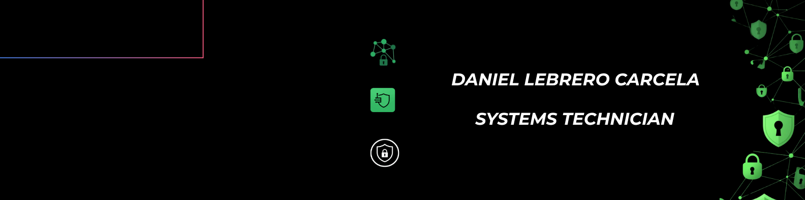

  

  <!-- BANNER / TYPING HEADER -->
  

  <!-- BADGES DE CONTACTO / REDES -->
  

    
    
    
    
  

---

# English

### 👨‍💻 About Me

- 💼 **Current Role:** Tier 1 / L1 Support Technician & Systems Management at **IaaS365**.
- 🎓 **Education:** B.S. in **Computer Engineering** at the **University of Seville** *(2022 – 2026)*.
- 🎯 **Core Focus:** Risk assessment, network security, physical security, and IT infrastructure administration.
- 📜 **Certifications:** Certified by **Cisco** in *Cybersecurity*, *Artificial Intelligence*, and *Internet of Things (IoT)*.
- 🚀 **Mission:** Committed to continuous learning, research, and delivering value in cybersecurity, automation, and tech innovation projects.

### 🛡️ Areas of Expertise & Interest

<table>
  <tr>
    <td width="50%">
      <h4>🔒 Cybersecurity & Networking</h4>
      <ul>
        <li>Risk assessment and management</li>
        <li>Perimeter defense and network security</li>
        <li>Physical security and access control</li>
        <li>Monitoring and incident response</li>
      </ul>
    </td>
    <td width="50%">
      <h4>🖥️ Systems & IT Operations</h4>
      <ul>
        <li>Tier 1 technical support and issue resolution</li>
        <li>Systems administration across IaaS/Cloud environments</li>
        <li>Infrastructure deployment and maintenance</li>
        <li>AI & IoT fundamentals applied to security</li>
      </ul>
    </td>
  </tr>
</table>

---

# Español

### 👨‍💻 Sobre Mí

- 💼 **Posición actual:** Técnico de Soporte N1 y Gestión de Sistemas en **IaaS365**.
- 🎓 **Formación:** Grado en **Ingeniería Informática** en la **Universidad de Sevilla** *(2022 – 2026)*.
- 🎯 **Enfoque profesional:** Evaluación de riesgos, seguridad de redes, seguridad física y administración de infraestructuras TI.
- 📜 **Certificaciones:** Certificado por **Cisco** en *Cybersecurity*, *Artificial Intelligence* e *Internet of Things (IoT)*.
- 🚀 **Objetivo:** Continuar formándome, investigando y aportando valor en proyectos de ciberseguridad, automatización e innovación tecnológica.

### 🛡️ Áreas de Especialización & Interés

<table>
  <tr>
    <td width="50%">
      <h4>🔒 Ciberseguridad & Redes</h4>
      <ul>
        <li>Evaluación y gestión de riesgos</li>
        <li>Seguridad perimetral y seguridad de redes</li>
        <li>Seguridad física y control de accesos</li>
        <li>Monitorización y respuesta ante incidentes</li>
      </ul>
    </td>
    <td width="50%">
      <h4>🖥️ Sistemas & Operaciones TI</h4>
      <ul>
        <li>Soporte técnico N1 y resolución de incidencias</li>
        <li>Administración de sistemas y entornos IaaS/Cloud</li>
        <li>Mantenimiento y despliegue de infraestructuras</li>
        <li>Fundamentos de IA & IoT aplicados a seguridad</li>
      </ul>
    </td>
  </tr>
</table>

---

### 🛠️ Tech Stack & Tools

  <!-- Languages -->
  
  
  
  

   

  <!-- Systems & Networking -->
  
  
  
  
  

---

### 📬 Get in Touch / Conectemos

Interested in collaborating on security, systems, or software projects? Feel free to reach out!  
*¿Te interesa colaborar en proyectos de seguridad, sistemas o desarrollo de software? ¡No dudes en contactarme!*

 

